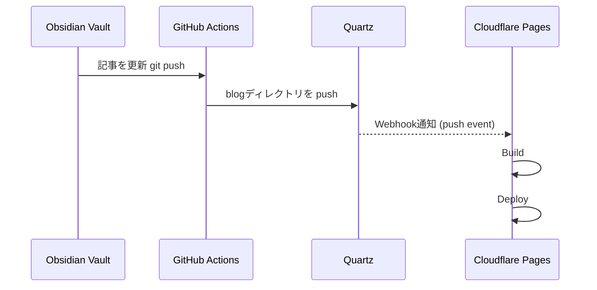

## デプロイはどうする？

技術的にはCloudflareにつなぐだけで良いのでまずはデプロイしてみる。
[公式](https://quartz.jzhao.xyz/hosting) の手順をどおりですぐにデプロイは終了。

### ここで課題がみつかる

 symlinkを使ってたからcontent空っぽじゃん...

方針
1. blogを書くときだけcontentをVaultとして開けばいいが、開き直すのめんどくさいのでやりたくない。
2. いつものVaultのblogsディレクトリだけquartzに移動して公開できる仕組みにしたい。
3. GitHub Actions でなんとかできないか？ 
4. ~~手元で毎回Copyコマンド叩いてPushするようにする~~？

なんとかCIで自動化してデプロイは意識せずに運用したい。・・・

ぐぐるとsubmoduleの方法を試している人がいた。

https://zenn.dev/ganariya/articles/deploy-quartz4-with-submodule

なるほど〜 この方法は良いヒントになる。

ただ懸念点もある。
- 特定のディレクトリのみ公開したいためVault全体はSubmoduleにしたくない。
- dispatchの作成とかも複雑になるしあまりやりたくない。

GPTと相談して以下のシーケンスにしてみた。 PATを登録すると vaultのレポからquartzのレポにPushできるらしいのでそれがシンプルにできそう。



### GitHub Actions の設定

privateレポジトリにPushするのでPATの発行と設定が必要。 withを使用すると仮想環境が `obsidian-blog` ディレクトリにquartz相当のrepoを配置してくれる。rsyncでそこに copy して差分Pushする仕組み。

```yml
name: Sync Quartz4

on:
  push:
    branches:
      - master

jobs:
  sync:
    runs-on: ubuntu-latest
    steps:
      - name: Checkout Quartz repo
        uses: actions/checkout@v3

      - name: Checkout Blog repo
        uses: actions/checkout@v3
        with:
          repository: 0123takaokeita/obsidian-blog
          token: ${{ secrets.QUARTZ_BLOG_PAT }}
          path: obsidian-blog

      - name: Sync blog content
        run: |
          cd obsidian-blog
          rsync -av --delete ../blogs/ ./content/
          git config user.name "github-actions"
          git config user.email "actions@github.com"
          git add .
          git commit -m "Sync blog content from Quartz" || echo "No changes"
          git push origin main

```

あとの課題は [[画像表示機能 | ]]